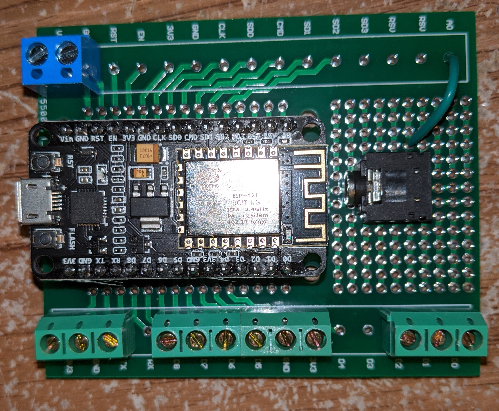

## Usage of Lock

Just tap your rfid card to the reader. The reader will call a web service that will verify the membership status. If OK the pin D0 will go from LOW to HIGH. This will trigger a relay and allow power to the tool. A 5 minute timer will then start. If the lock detects current flowing above a set threshold the timer will reset. This prevents the lock from turning power off while the tool is in use. After the timer completes the count down (5 minutes of not using the tool). The pin D0 will go back to LOW releasing the relay and cutting power to the tool.

## Wiring Diagram

<a href="https://github.com/frankjoshua/rfid_lock/blob/master/parts.jpg"></a>

### External connections

RED - +9V (tolerant 7.5V to 10V)<br>
BLACK - Ground<br>
White - RELAY<br>
GREEN - SCT-013 Current Sensor

## Initial Setup of Wifi and Asset tag

If the esp does not have a password for any available SSID it will then create its own access point named "ArchReactorLockout". Connect to that access point from a phone or computer. Then connect to http://192.168.4.1 This will display a config webpage. Click on "Configure WiFi" then add the correct SSID and password for your router. The esp will then reboot and connect to the WiFi access point that was configured. The last octet of the ip address will be displayed on the screen. You can use this address to configure the asset tag.

```
http://<IP_ADDRESS>/config?assetTag=<ASSET_TAG_ID>&key=<SECRET_KEY>
```

The first time you connect it will accept any secret key (string under 48 characters). That key will from that point need to be used to change settings. To set a new key use.

```
http://<IP_ADDRESS>/config?assetTag=<ASSET_TAG_ID>&key=<SECRET_KEY>&newKey=<NEW_SECRET_KEY>
```

Note you must also send the asset tag with the new key.
<br>
Note the esp8266 must be on the same network as the server for security purposes. The server will reject all non local authentication requests without review.

## Locking and unlocking remotely

An administrator may remotely lock or unlock the tools.

```
http://<IP_ADDRESS>/lock&key=<SECRET_KEY>
http://<IP_ADDRESS>/unlock&key=<SECRET_KEY>
```

## OTA Updates

```
http://<IP_ADDRESS>/upload&key=<SECRET_KEY>
```

When you visit this URL it will start the OTA server and redirect you to /update. You can the browse for the bin file that should be in <WORKSPACE>/rfid_lock/rfid_platform_io/.pio/build/nodemcuv2/frimware.bin

## Parts list

- [nodemcu (esp8266)](https://amz.run/3Mu4)
- [0.96" oled display](https://amz.run/3Mu5)
- [SCT-013 AC Current Sensor](https://amz.run/3Mu6)
- [RFID card Reader](https://amz.run/3MuC)
- [ABS Project Box](https://amz.run/3Mu7)
- [PCB Prototype Board](https://amz.run/3NYz)
- [3.5mm PCM mount Jacks](https://amz.run/3MuA)
- [220V to 7-10v 1 amp power supply (Needed)](https://amz.run/3Ugt)
- PCB and wires and terminals


